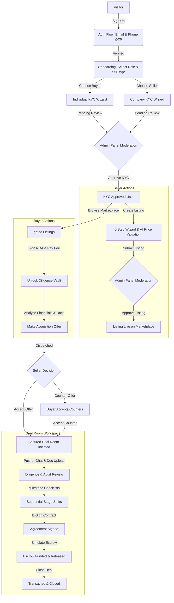

# FMI — Indian Digital Business Marketplace Manual Testing Guide

This manual testing guide is designed to systematically verify every feature, workflow, and user role in the **FMI (Indian Digital Business Marketplace)**. FMI is a trust-first platform (similar to Flippa, but tailored for India) featuring mandatory KYC verification, NDA-gated financials, Razorpay-secured digital consent, and structured transaction workspaces (Deal Rooms) with Pusher-backed real-time messaging.

This guide provides test procedures, expected outputs, validation patterns (such as PAN, GSTIN, and CIN regex), and mock data sets for testing all roles: **Buyer**, **Seller**, **Both (Buyer + Seller)**, and **Admin**.

---

## 🛠️ Testing Environment & Setup

Before starting the tests, ensure your local server is running and configured.

### 1. Prerequisites & Installation
Ensure you have the required environment variables in your `.env` file (copied from `.env.example`).
To set up and run the environment:
```bash
# Install dependencies
npm install

# Run database migrations to create/sync tables in Neon PostgreSQL
npm run db:push

# Start the Express + Vite server
npm run dev
```

### 2. Development Mode Bypasses (Hardcoded Stubs)
To expedite manual QA in a sandbox/development environment (`NODE_ENV=development`), the following bypasses are active:
* **Email & Phone Verification OTPs**: The code accepts `123456` as a valid OTP. OTP values are also logged to the backend console.
* **Razorpay Payments**: When Razorpay keys are omitted or run in sandbox mode, payments (NDA fee, listing fees) bypass live gates and complete successfully.
* **KYC Auto-Approval**: Standard KYC submissions simulate an auto-approval loop after a 3-second delay, updating the status to `approved`.
* **Pusher real-time notifications/messages**: If Pusher credentials are not provided, the interface falls back to local state updates.

---

## 📊 End-to-End Workflow Diagram



---

## 🔑 Phase A: Authentication & Identity Verification

Verify the core authentication flow, session management, and route protections built around [Better Auth](file:///d:/90%20days%20challenge/Zuntra%202nd%20Project/Indian-Digital-Market-Place/lib/auth.ts) and [auth.ts server actions](file:///d:/90%20days%20challenge/Zuntra%202nd%20Project/Indian-Digital-Market-Place/actions/auth.ts).

### Test Case A.1: New User Registration & Verification
1. Open the browser and navigate to the landing page at `http://localhost:3000/#/`.
2. Click the **Register** button in the top navigation bar.
3. Fill in the Signup form:
   * **Full Name**: `Amit Kumar`
   * **Email Address**: `amit.kumar@fmi.in`
4. Click **Create Account** / **Register**.
5. **Expected Output**: You are redirected to the **Verify Email** screen (`#/verify-email`). A toast message reads `"OTP sent!"` or `"Verification code sent to your email"`.
6. Test validation constraints:
   * Try typing `abc` in the OTP input. Note that it rejects non-numeric characters.
   * Try submitting an invalid 6-digit number (e.g., `999999`).
   * **Expected Output**: Shows an error toast `"Wrong OTP, try again"` or `"Invalid verification code"`.
7. Enter the sandbox OTP code `123456`.
8. **Expected Output**: Email is verified. Redirection to the **Verify Phone** screen (`#/verify-phone`) occurs automatically.
9. Enter phone details:
   * **Country Code**: `+91`
   * **Phone Number**: `9876543210`
10. Click **Send OTP**.
11. Enter the sandbox OTP `123456` and click **Verify**.
12. **Expected Output**: Redirection to the Onboarding role selection page (`#/onboarding/role`).

### Test Case A.2: Login Flow (Existing User)
1. Log out by clicking the user avatar in the top-right and selecting **Log Out**.
2. Navigate to `http://localhost:3000/#/login`.
3. Enter `amit.kumar@fmi.in` and click **Send OTP**.
4. Enter `123456` in the email verification boxes.
5. **Expected Output**: User is logged in successfully. User session is restored, and they are redirected to their last state or the main marketplace.

---

## 📋 Phase B: Compliance & KYC Onboarding Wizard

Verify the compliance and onboarding flow powered by [kyc.ts server actions](file:///d:/90%20days%20challenge/Zuntra%202nd%20Project/Indian-Digital-Market-Place/actions/kyc.ts).

### Test Case B.1: Role Selection & Onboarding Split
1. Navigate to onboarding path: `#/onboarding/role`.
2. Select **Buyer** card. Click **Continue**.
3. **Expected Output**: Selected card highlights with a green ring. The app redirects to the individual KYC page (`#/onboarding/kyc/individual`).
4. Go back to role selection and choose **Seller** or **Both**.
5. Select **Private Limited Company** as the constitution profile type. Click **Continue**.
6. **Expected Output**: Redirection to the company KYC wizard (`#/onboarding/kyc/company`).

### Test Case B.2: Individual KYC Wizard Verification
1. Navigate to `#/onboarding/kyc/individual`.
2. **Step 1: Personal Details**:
   * Prefilled legal name should match `Amit Kumar`.
   * Date of Birth: `15/08/1990`.
   * Address: `Flat 402, Royal Residency, M.G. Road, Bangalore, Karnataka, 560001`.
   * Click **Next Step**.
3. **Step 2: PAN Verification**:
   * Input PAN: `AMPDP9912` (incomplete).
   * **Expected Output**: An inline error or standard regex warning displays: `Invalid Indian PAN format`.
   * Complete PAN input: `AMPDP9912A`.
   * Drag and drop a mock PAN image file into the upload zone.
   * Click **Next Step**.
4. **Step 3: Aadhaar Verification**:
   * Aadhaar Last 4: `4567`.
   * Drag and drop front and back mock images.
   * Click **Next Step**.
5. **Step 4: Selfie & Bank Details**:
   * Account Holder Name: `Amit Kumar`.
   * Bank Account Number: `987654321098`.
   * Bank IFSC: `HDFC0000123`.
   * Drag and drop a mock selfie image.
   * Click **Submit & Verify** (or **Submit KYC**).
6. **Expected Output**:
   * In sandbox development mode, a success notification appears: `"KYC Profile Verified - Your PAN, Aadhaar, and identity checks have been validated."`
   * Redirection takes the user to the Buyer Interests screen (`#/onboarding/interests`) because the role was set to **Buyer** / **Both**.
   * User profile state updates: `kycStatus` is now `approved`.

### Test Case B.3: Company KYC Wizard Verification
1. Log in as a new user or reset KYC status to `not_started`.
2. Navigate to `#/onboarding/kyc/company`.
3. **Step 1: Company Details**:
   * Company Name: `Amit Solutions Pvt Ltd`
   * CIN: `U12345MH2020PTC12` (incomplete) -> Verify regex block.
   * CIN: `U12345MH2020PTC123456` (valid)
   * GSTIN: `27AMPDP9912A1Z` (incomplete) -> Verify regex block.
   * GSTIN: `27AMPDP9912A1Z5` (valid)
   * Year of Incorporation: `2020`
   * Click **Next**.
4. **Step 2: Company PAN & incorporation proof**:
   * Company PAN: `AAICA4321B`
   * Upload Certificate of Incorporation file.
   * Click **Next**.
5. **Step 3: Director Details**:
   * Director Legal Name: `Amit Kumar`
   * Director PAN: `AMPDP9912A`
   * Director Aadhaar: `4567`
   * Click **Next**.
6. **Step 4: Bank Details**:
   * Account: `50200012345678`
   * IFSC: `HDFC0000123`
   * Upload cancel cheque copy.
   * Click **Submit & Verify**.
7. **Expected Output**: KYC submitted successfully. Status changes to `pending` (which auto-promotes to `approved` in development sandbox).

---

## 🏷️ Phase C: Sell-Side Listing Creation Wizard

Verify listing creation, valuation estimations, and listing status states powered by [listings.ts server actions](file:///d:/90%20days%20challenge/Zuntra%202nd%20Project/Indian-Digital-Market-Place/actions/listings.ts).

### Test Case C.1: 6-Step Seller Wizard & AI Valuation
1. Make sure your logged-in user role is **Seller** or **Both** and `kycStatus` is `approved`.
2. Click **List Your Asset** in the hero header or navigate to `#/seller/listings/new`.
3. **Step 1: Asset Type Selection**:
   * Select **SaaS / Web App** card. Click **Next Step** (or progress triggers automatically).
4. **Step 2: Basic Information**:
   * Title: `PayStream Invoice Automation Tool`
   * Tagline: `GST-compliant invoicing and billing middleware for Indian small businesses.`
   * Industry: Select `Technology & Software`.
   * Business URL: `https://paystream.in`.
   * Year Established: `2023`.
   * Team Size: `3`.
   * Hours per week: `10`.
   * Business Model: `SaaS / Subscription`.
   * Click **Next Step**.
5. **Step 3: Financial Metrics & AI Price Estimator**:
   * Asking Price: `45,00,000` (₹45 Lakhs)
   * Monthly Revenue: `3,20,000` (₹3.2 Lakhs)
   * Monthly Profit: `2,10,000` (₹2.1 Lakhs)
   * Monthly Traffic: `12,500`
   * Observe **Monthly Expenses**: Verify it automatically calculates to `₹1,10,000` (Revenue - Profit).
   * Observe **Profit Multiplier**: Check that it displays the multiple (e.g., `Asking Price / (Monthly Profit * 12) = ~1.8x`).
   * Click the **Suggest Asking Price** / **AI Valuation** button.
   * **Expected Output**: A loading indicator appears, followed by a panel rendering simulated AI pricing advice (e.g., suggested price range between `₹38,00,000` and `₹50,00,000` based on Indian software multiples, alongside reasoning notes).
   * Click **Next Step**.
6. **Step 4: Document Upload**:
   * Drop files into:
     * **Financial Statements** (last 12 months P&L) - *Required*
     * **Analytics Screenshot** - *Required*
     * **Ownership Proof** - *Required*
   * Verify file-size constraint: Try uploading a file >10MB.
   * **Expected Output**: An error toast states the file size exceeds the 10MB limits.
   * Drop valid small mock images/PDFs.
   * Click **Next Step**.
7. **Step 5: Listing Story**:
   * Description: `PayStream is a highly polished, subscription-based billing SDK and portal designed for small businesses to auto-generate tax invoices, push GSTR-1 records directly to Government gateways, and accept payments via UPI. Currently servicing 112 active clients with gross churn under 2%.`
   * Reason for sale: Select `Lifestyle change` or `New opportunities`.
   * What's included in sale: Check `Source code`, `Domain`, `Social accounts`, `Customer list`.
   * Highlight strengths: `Clean codebase, low hosting costs, direct API integrations.`
   * Click **Next Step**.
8. **Step 6: Pricing & Settings**:
   * Ask Price Confirmation: `₹45,00,000`.
   * Pricing Model: `Classified`.
   * Require mutual NDA: Toggle **ON** (Checked).
   * NDA Fee: `₹999`.
   * Upload Cover Image: Drop a mock dashboard preview image.
   * Tags: `SaaS, Invoicing, B2B, GST`.
   * Verify the **Live Preview Card** updates in real-time at the bottom or side, displaying the price, tagline, and locked diligence badge.
9. Click **Generate Drizzle Record & List Live** / **Submit for Review**.
10. **Expected Output**: Re-direction to the Seller Listings view (`#/seller/listings`). A success toast displays `"Listing Created Successfully - Your digital asset is now live on FMI marketplace."`

---

## 🔍 Phase D: Buy-Side Browsing & Diligence Gate

Verify marketplace search, filtering, and the Razorpay Stamp Duty payment gateway simulation for NDA unlocks.

### Test Case D.1: Search & Filter Validation
1. Log in or switch to a **Buyer** user profile.
2. Click **Marketplace** / **Browse Live Deals** in the navigation header (`#/listings`).
3. Observe pre-seeded Listings:
   * `HRTech Automated Payroll Platform for Indian SMEs` (Asking Price: ₹3.1 Cr, NDA required: Yes, fee: ₹999)
   * `Eco-Friendly Ayurvedic D2C Wellness Brand` (Asking Price: ₹4.2 Cr, NDA required: Yes, fee: ₹1,499)
   * `Indian Personal Finance BFSI Hub` (Asking Price: ₹85 L, NDA required: No, fee: ₹0)
   * `Hyperlocal QuickCommerce Route Optimization API` (Asking Price: ₹1.2 Cr, NDA required: Yes, fee: ₹0)
   * `Indie Dev Showcase & Mockup Generator` (Asking Price: ₹45 L, NDA required: No, fee: ₹0)
4. Verify asset type filter:
   * Click the **SaaS / Web App** filter pill.
   * **Expected Output**: The list updates to show only HRTech, Route Optimization API, and your newly created listing (`PayStream`).
   * Click **All Assets** to reset.
5. Verify text search:
   * Type `Ayurvedic` in the search bar.
   * **Expected Output**: Only the `Eco-Friendly Ayurvedic D2C Wellness Brand` card remains visible.
   * Clear the search.

### Test Case D.2: Digital Mutual NDA & Razorpay Checkout Sandbox
1. Locate the listing card for `HRTech Automated Payroll Platform` (NDA Required: Yes, fee: ₹999).
2. Note that private fields like Description (truncated), Business URL, and Financial Documents are hidden under a lock icon showing: `"Private Business Documents Gated"`.
3. Click **Sign Mutual NDA**.
4. **Expected Output**: The NDA modal overlays the screen, displaying the legal terms:
   * Seller reference: `#L-8823`
   * Registered Buyer: `Amit Kumar`
   * NDA fee: `₹999`
5. Test validation in signature input:
   * Leave the signature field blank and click **Execute Agreement & Pay**.
   * **Expected Output**: An alert/toast displays: `"Please sign your name digitally to execute the NDA."`
6. Type `Amit Kumar` in the legal signature field.
7. Click **Execute Agreement & Pay**.
8. **Expected Output**: The button changes to `"Executing razorpay checkout..."` with a spinner.
9. Wait 1.8 seconds.
10. **Expected Output**: The modal closes. A success toast notifications fires: `"NDA Signed & Verified"`.
11. Observe the target listing card:
    * The gated block transforms into `"Diligence Vault Unlocked"`.
    * The full private description, Business URL (`https://paygenius.in`), and verified GA files list are revealed.
    * Active buttons appear: **Deal Room** and **Make Offer**.

---

## 🤝 Phase E: Acquisition Offer Negotiation Flow

Verify the formal tender, earn-out structures, and notifications powered by [offers.ts server actions](file:///d:/90%20days%20challenge/Zuntra%202nd%20Project/Indian-Digital-Market-Place/actions/offers.ts).

### Test Case E.1: Submitting an Acquisition Offer
1. On the unlocked `HRTech Automated Payroll Platform` card, click **Make Offer**.
2. **Expected Output**: The formal tender modal opens:
   * Target Listing: `HRTech Automated Payroll Platform for Indian SMEs`
   * Asking Price reference: `₹3,10,00,000`
3. Enter offer details:
   * **Your Offer Price (₹)**: `2,80,00,000` (₹2.8 Crore)
   * **Upfront Capital (%)**: `80`
   * **Earn-out (%)**: `20`
   * **Earn-out targets**: `20% released on reaching ₹15L MRR targets within 12 months post-acquisition.`
   * **Introduction message**: `Hi, I am an experienced HRTech investor backed by a private equity fund. Ready to fund immediately after a 14-day diligence check.`
4. Click **Submit Formal Tender**.
5. **Expected Output**:
   * A success notification displays: `"Offer Submitted - Your offer of ₹2,80,00,000 has been dispatched to the seller."`
   * Under the hood, a new Deal Room is instantiated in the user's database.
   * You are redirected or see the listing added to **Active Deals** in the user console with status `due_diligence`.
   * After 4.5 seconds (simulated Pusher websocket delay), a notification toast appears: `"Pusher Notification - Seller received your proposal and is preparing a response."`

---

## 🔒 Phase F: Secured Transaction Room (Deal Room)

Verify real-time communication, stage gates, and checklist milestones powered by [deals.ts server actions](file:///d:/90%20days%20challenge/Zuntra%202nd%20Project/Indian-Digital-Market-Place/actions/deals.ts).

### Test Case F.1: Deal Room Layout & Stages
1. In the **Active Deals** panel in the right sidebar console, click on the deal card for the HRTech listing.
2. **Expected Output**: The secured transaction room sheet slides up and overlays the screen:
   * Header details: `Room #L-8823`, listing title, deal price (`₹2,80,00,000`), and structure breakdown.
   * **Stage Progress Tracker**: Check that 5 stages are displayed:
     1. **Due Diligence** (Currently Active - Orange)
     2. **Agreement** (Pending - Gray)
     3. **Escrow** (Pending - Gray)
     4. **Transfer** (Pending - Gray)
     5. **Closed** (Pending - Gray)

### Test Case F.2: Pusher Real-Time Messaging Stream
1. Navigate to the chat panel in the right-hand column: **Simulated Negotiation Stream**.
2. Type message: `Hi, please upload your GSTR-1 and GSTR-3B filings for the last financial year.`
3. Click **Send** (or hit Enter).
4. **Expected Output**:
   * Message is instantly appended to the list, right-aligned, with sender tag `buyer`.
   * The input text resets.
5. Wait 2 seconds.
6. **Expected Output**:
   * A simulated real-time response from the seller is appended to the left side of the chat.
   * A toast notification fires: `"New Realtime Message - The seller sent a response in your Deal Room chat."`
   * Message content reads: `"Received: 'Hi, please upload...'. Our tech lead can jump on a quick call this week..."`

### Test Case F.3: Milestones Checklist & Stage Shift
1. Find the **Acquisition Milestones Checklist** card.
2. Observe 6 default checklists:
   * *c1*: `Complete diligence review of financials` (Assigned: Buyer)
   * *c2*: `Verify real-time Google Analytics & traffic statistics` (Assigned: Buyer)
   * *c3*: `Review proprietary technology & codebase blueprints` (Assigned: Buyer)
   * *c4*: `Sign Asset Purchase Agreement contract` (Assigned: Both)
   * *c5*: `Fund Indian Escrow transaction account` (Assigned: Buyer)
   * *c6*: `Transfer domain and operational host credentials` (Assigned: Seller)
3. Click the checkbox next to `Complete diligence review of financials`.
4. **Expected Output**: The item highlights in green, shows a strike-through text decoration, and remains checked.
5. Test stage progression:
   * Click the button **Advance to APA Agreement**.
   * **Expected Output**:
     * The stage progress tracker shifts the active stage to **Agreement** (Stage 2).
     * A toast displays: `"Deal Status Shift - FMI Deal stage updated to: AGREEMENT"`.
     * A system message is appended to the chat stream.
   * Click the button **Simulate Escrow Funding**.
   * **Expected Output**:
     * Stage tracker shifts to **Escrow** (Stage 3).
     * Toast displays: `"Deal Status Shift - FMI Deal stage updated to: ESCROW"`.

---

## 👑 Phase G: Admin Dashboard & Queue Moderation

Verify the admin panel operations, queues, AI listing score, and user suspensions powered by [admin.ts server actions](file:///d:/90%20days%20challenge/Zuntra%202nd%20Project/Indian-Digital-Market-Place/actions/admin.ts).

### Test Case G.1: Accessing the Admin Layout
1. Log out from the current buyer/seller session.
2. Sign in as admin:
   * **Email**: `admin@fmi.in`
   * **OTP**: `123456`
3. Click the user profile dropdown and select **Admin Console** (or verify the redirection path `/admin`).
4. **Expected Output**:
   * Admin-specific sidebar displays navigation choices: **Dashboard**, **Listings Moderation**, **KYC Review**, **Deals Monitor**, **User Management**, and **Reports**.
   * A red `"ADMIN"` badge is visible in the header/sidebar.

### Test Case G.2: KYC Review Queue
1. Click **KYC Review** in the admin sidebar.
2. Select **Pending Review** tab.
3. Locate the profile card submitted by `Amit Kumar`.
4. Click **Review Documents**.
5. **Expected Output**: The KYC detail viewer displays:
   * Submitted PAN: `AMPDP9912A`.
   * Aadhaar last 4: `4567`.
   * Images: PAN copy, Aadhaar scans, selfie match.
   * Action buttons: **Approve KYC** and **Reject KYC**.
6. Click **Approve KYC**.
7. **Expected Output**: The card is removed from the pending queue. The user profile is updated to `kycStatus = approved`. An automated email and push notification is triggered to the user.
8. Locate another user card. Click **Reject KYC**.
9. **Expected Output**: A dialog prompts for a rejection reason (e.g. `PAN image unclear`). Enter the reason and submit. The user is notified to resubmit.

### Test Case G.3: Listings Moderation Queue & AI Scoring
1. Click **Listings Moderation** in the admin sidebar.
2. Find the listing submitted by seller: `PayStream Invoice Automation Tool`.
3. Click **Moderate Listing**.
4. Check the **AI Code Quality & Appeal Score** section:
   * Click **Run AI Evaluation**.
   * **Expected Output**: A loading animation completes. A rating between `1-10` is given (e.g. `8/10`), indicating layout completeness, pricing multiple check, and flag list (if any).
5. Click **Approve & Publish**.
6. **Expected Output**: Listing status is set to `live`. The asset becomes visible to all public buyers on the marketplace.

---

## 📡 Phase H: Health Check & Environment Status

Verify integration logs and credentials configuration.

### Test Case H.1: System Integration Audit
1. Navigate directly to URL `http://localhost:3000/#/health` or `http://localhost:3000/api/health-check` (API level).
2. **Expected Output**: A diagnostics panel displays showing green checkmarks/OK status for core environment bindings:
   * **Neon Database (PostgreSQL)**: `Connected / OK`
   * **Upstash Redis**: `Responding`
   * **Pusher Channels**: `Configured`
   * **Razorpay Client**: `Sandbox / Live Mode`
   * **Resend Service**: `Connected`
   * **Cloudinary Storage**: `OK`

---

## 🎯 Reference Input Validation Matrix

Ensure inputs conform to the following formats during manual testing to prevent frontend/backend validation errors:

| Field Target | Expected Format / Rule | Valid Example | Invalid Example |
| :--- | :--- | :--- | :--- |
| **Individual PAN** | Regex: `/^[A-Z]{5}[0-9]{4}[A-Z]{1}$/` (10 characters) | `AMPDP9912A` | `AMP12345A` (length/type mismatch) |
| **Company CIN** | Regex: `/^[L|U][0-9]{5}[A-Z]{2}[0-9]{4}[A-Z]{3}[0-9]{6}$/` | `U12345MH2020PTC123456` | `U12345MH2020PTC` (too short) |
| **GSTIN** | Format: `2-digit state` + `10-digit PAN` + `1-entity` + `Z` + `1-check` | `27AMPDP9912A1Z5` | `GSTIN12345` |
| **IFSC Code** | Format: `4 letters` + `0` + `6 digits` (11 characters) | `HDFC0000123` | `HDFCA12345` |
| **Aadhaar Last 4** | Exact 4 digits | `4567` | `456` |
| **Acquisition Budget**| Positive integer in INR | `2500000` (₹25L) | `-50000` |
| **NDA signature** | Non-empty text | `Amit Kumar` | ` ` (spaces only) |
